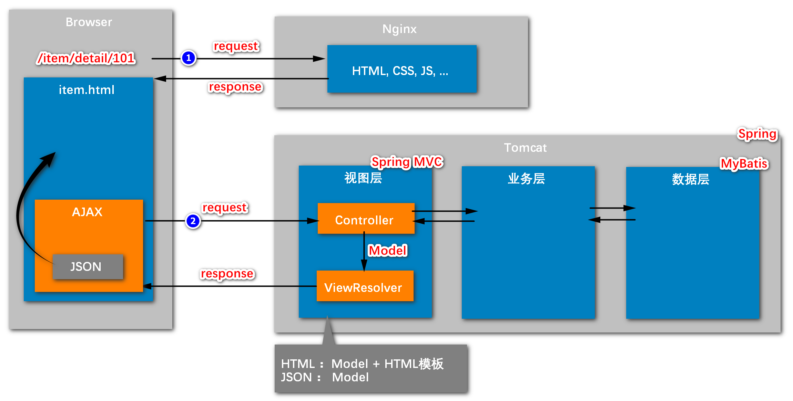
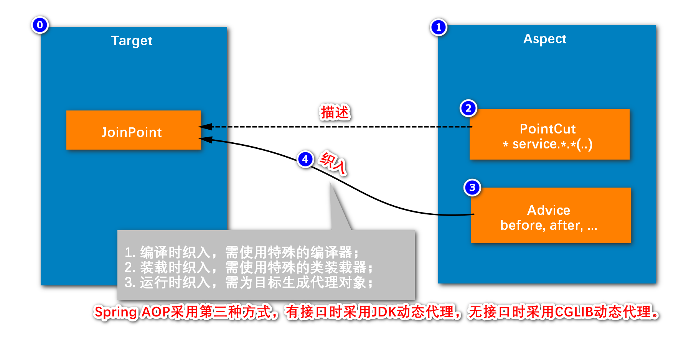
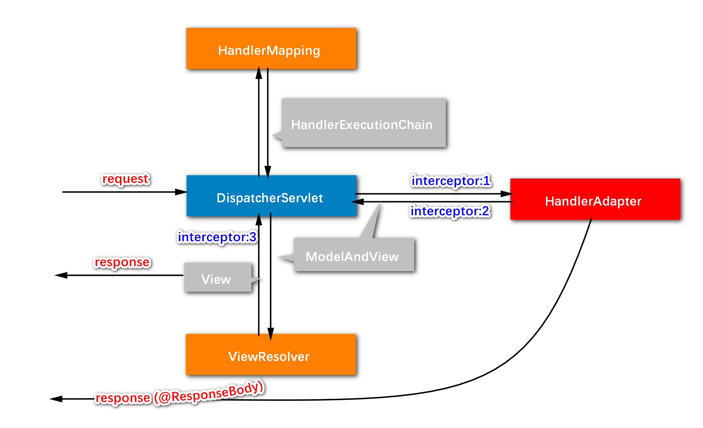

# 1 功能
  &nbsp;&nbsp;如图是spring、spring MVC、spring boot的简单功能概要。<br/>
  &nbsp;&nbsp;<br/>
  &nbsp;&nbsp;

# 2 springBoot 
## 2.1 构建项目 


# 3 Spring
## 3.1 IOC
### 3.1.1 IOC实现可插拔（对spring的理解）
1. 例如：接口UserDao；
2. 其实现类UserDaoHibernateImpl与UserDaoJdbcImpl；
3. 只使用其中一个，那么只能对其中一个加@Repository注解；
4. 或者两个都加，但是这样的话要选择优先级，那么可以对其中要使用的那个加上@Primary注解。
5. 总结：从这里我学到了spring调用接口方法，其实调用了其实现类的方法，只不过是用了@Repository进行Bean的自动管理。

### 3.1.2 IOC管理哪些Bean
问题：为什么entity下的User类就不使用IOC（@Repository等Bean的注解）进行Bean的管理？
1. IOC一般用于管理**可复用的、不变的**类；不可复用的、易变的类不适用IOC进行管理。<br/>
   如dao和service，它们都是单例的，只需要实例化一次即可反复使用，因为那些类中没有数据，没有直接的成员变量，只是一个逻辑，这种逻辑是可以复用的，像这种可以复用的、一般可以单例的，我们都可以使用IOC进行管理。
   package com.nowcoder.example.dao.impl;<br/>
   如，UserDaoJdbcImpl.java：
    ```java
    package com.nowcoder.example.dao.impl;
    
    import com.nowcoder.example.dao.UserDao;
    import com.nowcoder.example.entity.User;
    import org.springframework.stereotype.Repository;
    
    @Repository
    public class UserDaoJdbcImpl implements UserDao {
        @Override
        public User findById(int id) {
            System.out.println("select with jdbc.");
            User user = new User();
            user.setId(id);
            user.setUsername("user-" + id);
            user.setPassword("123456");
            return user;
        }
    }
    ```

2. User是封装数据的实体。<br/>
   它在程序中需要有多个实例，例如：有10000个用户，就需要10000个user。
   一般来说，频繁发生变化，且需要很多实例的类，都不使用IOC进行管理。<br/>
    如，User.java：
    ```java
    package com.nowcoder.example.entity;
    
    public class User {
    
        private Integer id;
        private String username;
        private String password;
        // getter、setter以及toString方法略...
    }
    ```
### 3.1.3 哪些层有接口
1. controller没有接口，service和dao有接口；
2. 原因：controller是由浏览器页面去调用的，若是要换一个controller类的话，那就重写一个controller类即可；<br/>
而dao、service要换的话，只需要重写接口的实现类（不使用浏览器页面进行调用）即可。

### 3.1.4 总结
  &nbsp;&nbsp;&nbsp;&nbsp;IOC解决的是Bean的管理和bean之间的依赖的问题。
### 3.1.5 IOC控制Bean的生命周期以及作用域
1. IOC管理Bean的生命周期 -- 在UserServiceImpl.java中
   <br/>1）@PostConstruct
   <br/>2）@PreDestroy
   
2. IOC管理Bean的作用域
   <br/>1）bean作用域的含义：在Spring里面，设置创建bean实例是单实例还是多实例
   <br/>2）做法：在需要使用多例的类上面加上 **@Scope("prototype")** 注解即可。

## 3.2 ApplicationContext
1. 核心功能：获取bean。
2. 获取bean的方法：
  <br/>&nbsp;&nbsp;1）`private ApplicationContext applicationContext; ` -- 获取ApplicationContext类的实例对象
  <br/>&nbsp;&nbsp;2）`applicationContext.getBean(UserDao.class); ` -- 使用ApplicationContext的getBean()方法得到bean
  <br/>&nbsp;&nbsp;3）`applicationContext.getBean(xxx); ` -- getBean()方法可以使用不同的传入参数
3. 代码：
   ```java
   package com.nowcoder.example;
   
   @SpringBootTest
   class ExampleApplicationTests implements ApplicationContextAware {
   
       // ApplicationContext extends BeanFactory
       // BeanFactory -> Spring Framework Developer
       // ApplicationContext -> plain Developer
       private ApplicationContext applicationContext;
   
       @Autowired
       private UserService userService;
       @Override
       public void setApplicationContext(ApplicationContext applicationContext) throws BeansException {
           this.applicationContext = applicationContext;
       }
   
       @Test
       public void testApplicationContext() {
           UserDao dao1 = applicationContext.getBean(UserDao.class);
           System.out.println(dao1.findById(161));
   
           UserDao dao2 = (UserDao) applicationContext.getBean("userDaoHibernateImpl");
           System.out.println(dao2.findById(162));
   
           UserDao dao3 = applicationContext.getBean("userDaoHibernateImpl", UserDao.class);
           System.out.println(dao3.findById(163));
       }
   
   }
   ```

## 3.3 AOP
1. 概念：面向切面编程。它能够解决一些公共的需求，比如有很多组件都需要做同样的事情，并且是以低耦合、可插拔的方式解决。如图：
  &nbsp;&nbsp;
2. 问题分析：
  <br/>&nbsp;&nbsp;1）需求：例如有ABCDE这5个bean都需要记日志，那么就可以使用AOP统一去做，而且这5个bean不需要更改任何代码；
  <br/>&nbsp;&nbsp;2）分析：那么AOP是如何做到的呢？
  <br/>&nbsp;&nbsp;&nbsp;&nbsp;&nbsp;&nbsp;a）表面上，是使用@Aspect、@Pointcut(bean路径)、@Before等注解，写出“记日志”的动作，那么指定路径的“bean”就会执行记日志的动作。
  <br/>&nbsp;&nbsp;&nbsp;&nbsp;&nbsp;&nbsp;b）而底层情况，实际上是将“记日志”方法的代码，“织入”到相应的bean里面去，于是在类对象下执行了相应的“记日志”方法的代码。
3. 代码 -- 注意看LogAspect.java，其中的@PointCut的参数。
   ```java
   package com.nowcoder.example.aspect;
   
   import org.aspectj.lang.ProceedingJoinPoint;
   import org.aspectj.lang.annotation.*;
   import org.springframework.stereotype.Component;
   
   @Component
   @Aspect
   public class LogAspect {
   
       @Pointcut("execution(* com.nowcoder.example.service.*.*(..))")
       private void serviceAccess() {
   
       }
   
   //    @Before("serviceAccess()")
       public void before() {
           System.out.println("log before");
       }
   
   //    @AfterThrowing("serviceAccess()")
       public void afterThrowing() {
           System.out.println("log afterThrowing");
       }
   
   //    @AfterReturning("serviceAccess()")
       public void afterReturning() {
           System.out.println("log afterReturning");
       }
   
   //    @After("serviceAccess()")
       public void after() {
           System.out.println("log after");
       }
   
       @Around("serviceAccess()")
       public Object log(ProceedingJoinPoint joinPoint) {
           Object obj = null;
           try {
               System.out.println("log before");
               // 调用目标组件的方法
               obj = joinPoint.proceed();
               System.out.println("log afterReturning");
           } catch (Throwable throwable) {
               System.out.println("log afterThrowing");
           } finally {
               System.out.println("log after");
           }
   
           return obj;
       }
   
   }
   ```
4. 各个注解：
  <br/>&nbsp;&nbsp;1）@Aspect、@Pointcut；
  <br/>&nbsp;&nbsp;2）@Before、@AfterThrowing、@AfterReturning、@After、@Around.
## 3.4 BeanFactory
  &nbsp;&nbsp;一般是开发Spring框架的人员使用，普通的使用Spring框架的开发者不会使用。

# 4 SpringMVC
## 4.1 问题
1. spring的IOC如何与SpringMVC衔接起来？（如上图2的工作流程）<br/>
  &nbsp;&nbsp;&nbsp;&nbsp;-- 而由于SpringMVC是处理view（视图）的问题，并且controller又是最终被浏览器调用并显示；所以，实际上就是要问如何将数据显示到浏览器页面上？亦即，service如何被controller调用的问题。
2. service是如何被controller调用的？-- 在UserController.java中：
  <br/>&nbsp;&nbsp;1）@Controller -- Bean管理创建当前类（在UserController）的对象
  <br/>&nbsp;&nbsp;2）@RequestMapping(path = "/user") -- 当前类的浏览器url路径
  <br/>&nbsp;&nbsp;3）@Autowired -- 导入service，虽然是放在UserService上面，但是是导入其实现类的对象。（Bean管理创建UserService实现类的对象
  <br/>&nbsp;&nbsp;4）@RequestMapping(path = "/detail/{id}", method = RequestMethod.GET) -- 当前方法的浏览器url路径，{id}表示是一个参数
  <br/>&nbsp;&nbsp;5）@ResponseBody -- 表示结果在浏览器中以json格式显示
  <br/>&nbsp;&nbsp;6）@PathVariable("id") -- 使用在方法的参数前，表示获取前面{id}实际填入浏览器中的值
3. 代码<br/>
   ```java
   package com.nowcoder.example.controller;
   
   import com.nowcoder.example.entity.User;
   import com.nowcoder.example.service.UserService;
   import org.springframework.beans.factory.annotation.Autowired;
   import org.springframework.stereotype.Controller;
   import org.springframework.web.bind.annotation.PathVariable;
   import org.springframework.web.bind.annotation.RequestMapping;
   import org.springframework.web.bind.annotation.RequestMethod;
   import org.springframework.web.bind.annotation.ResponseBody;
   
   @Controller
   @RequestMapping(path = "/user")
   public class UserController {
   
       @Autowired
       private UserService userService;
   
       // /user/detail/1
       @RequestMapping(path = "/detail/{id}", method = RequestMethod.GET)
       @ResponseBody
       public User getUser(@PathVariable("id") int id) {
           // {id:1,username:'',password:''}
           return userService.getUser(id);
       }
   
   }
   ```
## 4.2 SpringMVC工作流程
1. 大致流程逻辑图
  <br/>&nbsp;&nbsp;1）DispatcherServlet，核心；
  <br/>&nbsp;&nbsp;2）HandlerMapping，；
  <br/>&nbsp;&nbsp;&nbsp;&nbsp;-- HandlerMapping，；
  <br/>&nbsp;&nbsp;3）HandlerAdapter，；
  <br/>&nbsp;&nbsp;&nbsp;&nbsp;-- ModelAndView，；
  <br/>&nbsp;&nbsp;&nbsp;&nbsp;-- Interceptor1，；
  <br/>&nbsp;&nbsp;&nbsp;&nbsp;-- Interceptor2，；
  <br/>&nbsp;&nbsp;&nbsp;&nbsp;-- response(@ResponseBody)，；
  <br/>&nbsp;&nbsp;4）ViewResolver，；
  <br/>&nbsp;&nbsp;&nbsp;&nbsp;-- Interceptor3，；
  <br/>&nbsp;&nbsp;&nbsp;&nbsp;-- view，；
  <br/>&nbsp;&nbsp;&nbsp;&nbsp;-- response，；
  <br/>&nbsp;&nbsp;5），；
  <br/>&nbsp;&nbsp;
2. 源码流程
  <br/>&nbsp;&nbsp;如何去了解源码呢？-- 先找到DispatcherServlet.java源码，再结合上流程述逻辑图，找到DispatcherServlet类的doDispatch()方法，找到其中关键的几个组件和流程，对应到相应的代码，进行阅读即可。
  <br/>&nbsp;&nbsp;1）DispatcherServlet -- 作为类；位于图中最中间。
  <br/>&nbsp;&nbsp;2）doDispatch()方法 -- 核心方法，涉及到的组件都会在这个方法出现。
  <br/>&nbsp;&nbsp;2）doDispatch()方法 -- 核心方法，涉及到的组件都会在这个方法出现。
3. 面试总结

## 4.3 总结
1. IOC解决的是bean之间的依赖关系；
2. SpringMVC解决的是controller调用service，并将结果显示在页面上的问题。