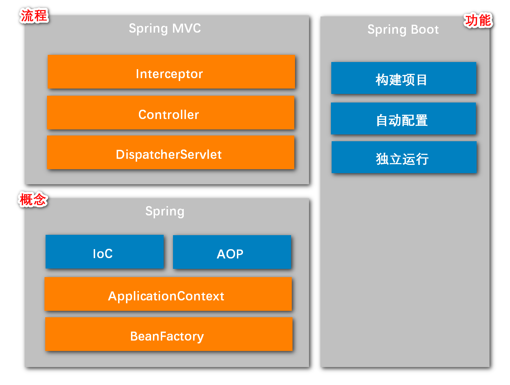

# 1 功能
如图是spring、spring MVC、spring boot的简单功能概要。

# 2 springBoot 构建项目

# 3 springIOC 实现可插拔
1. 例如：接口UserDao；
2. 其实现类UserDaoHibernateImpl与UserDaoJdbcImpl；
3. 只使用其中一个，那么只能对其中一个加@Repository注解；
4. 或者两个都加，但是这样的话要选择优先级，那么可以对其中要使用的那个加上@Primary注解。
5. 总结：从这里我学到了spring调用接口方法，其实调用了其实现类的方法，只不过是用了@Repository进行Bean的自动管理。
