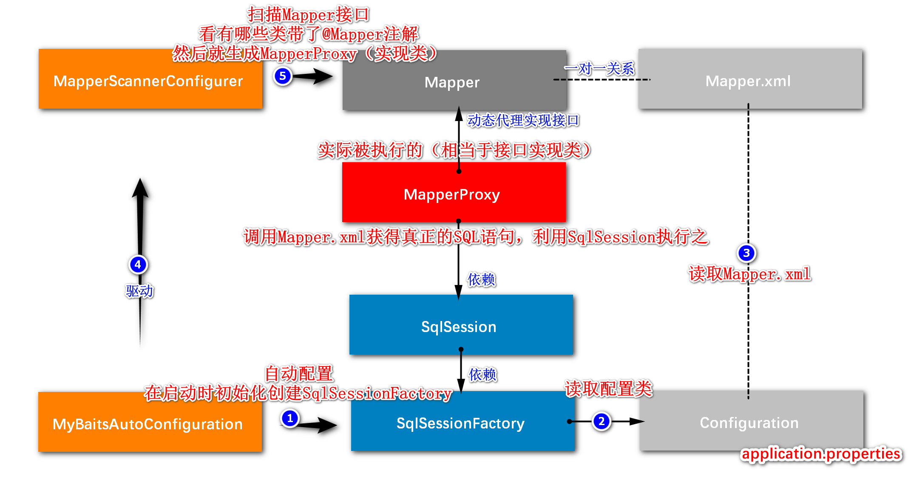
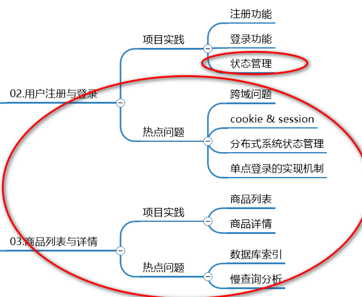
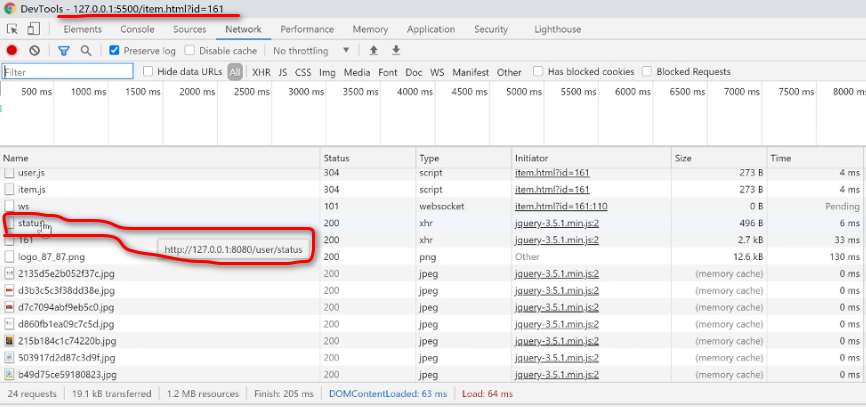
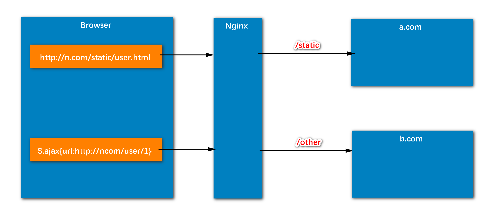
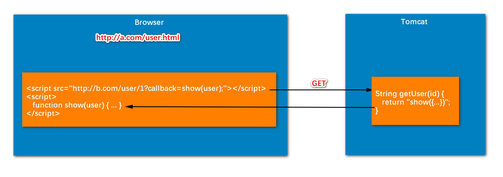
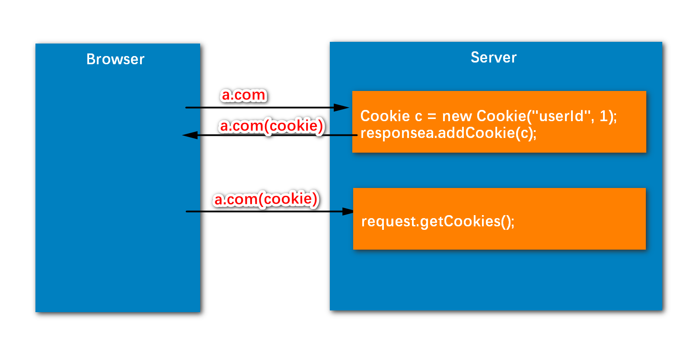
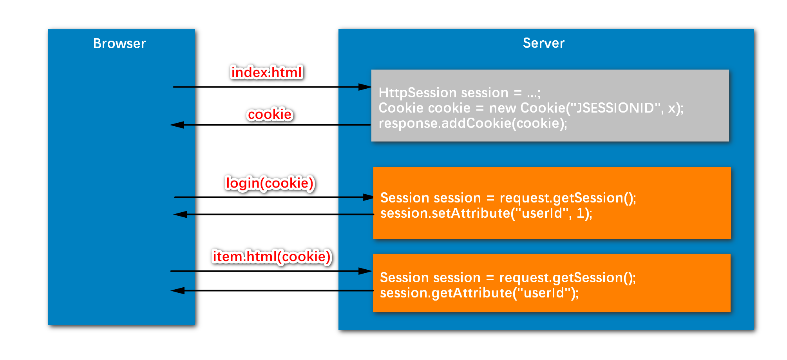
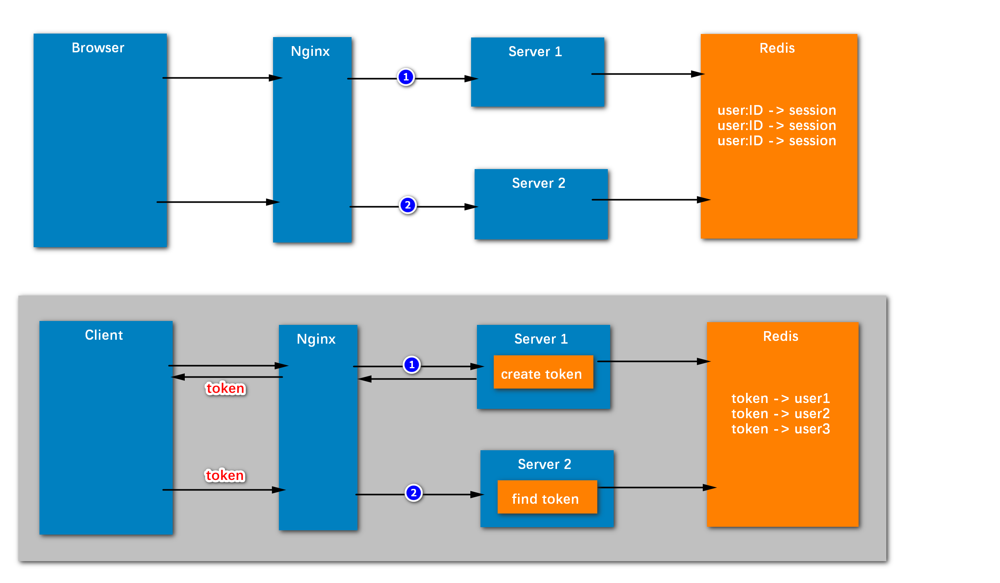
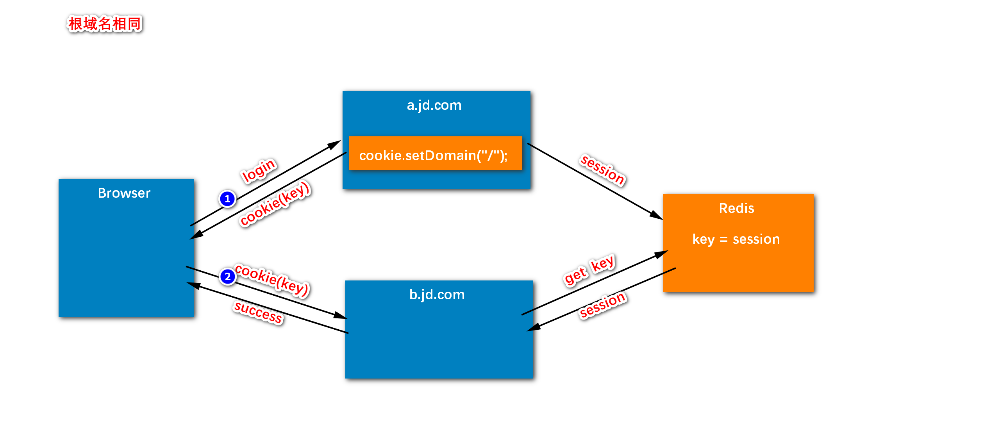
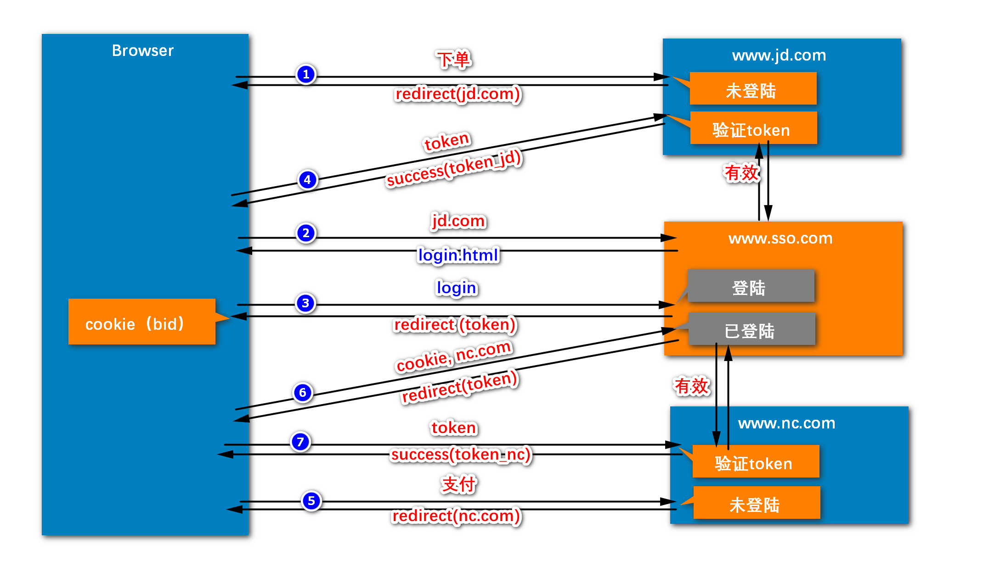

# 1 Mybatis
## 1.1 Mybatis项目管理
  -- 创建与生成
  参考博客：https://blog.csdn.net/qq_45401910/article/details/123345742
1. 使用Mybatis需要手动创建的文件：
  <br/>&nbsp;&nbsp;1）pom.xml，指定插件：
    ```xml
    <plugins>
        <plugin>
            <groupId>org.springframework.boot</groupId>
            <artifactId>spring-boot-maven-plugin</artifactId>
        </plugin>
        <plugin>
            <groupId>org.mybatis.generator</groupId>
            <artifactId>mybatis-generator-maven-plugin</artifactId>
            <version>1.3.7</version>
            <dependencies>
                <dependency>
                    <groupId>mysql</groupId>
                    <artifactId>mysql-connector-java</artifactId>
                    <version>8.0.22</version>
                </dependency>
            </dependencies>
            <configuration>
                <configurationFile>
                    src/main/resources/mybatis-generate-config.xml
                </configurationFile>
            </configuration>
        </plugin>
    </plugins>
    ```
  <br/>&nbsp;&nbsp;2）上述插件中提到的mybatis-generate-config.xml，确定连接数据库的基本信息+后面生成文件的存放位置+需要操作的表的基本信息；

2. 使用Mybatis自动生成的文件：
  <br/>&nbsp;&nbsp;1）如何生成？-- 在命令行执行：mvn mybatis-generator:generate（参考[博客](https://blog.csdn.net/fengcai0123/article/details/85273714)）
  <br/>&nbsp;&nbsp;2）生成哪些？
  <br/>&nbsp;&nbsp;&nbsp;&nbsp;a、Item.java--实体类；于/src/main/java/entity/目录下。
  <br/>&nbsp;&nbsp;&nbsp;&nbsp;b、ItemMapper.java--接口类，数据库操作方法，但无具体实现；于/src/main/java/dao/目录下。（没有具体实现，且又没有接口实现类的话，那么代码如何实现具体的sql语句？如3）所示，有了3）就有了具体的sql语句；结合动态代理，即可实现与接口实现类同样的功能）。
  <br/>&nbsp;&nbsp;&nbsp;&nbsp;c、ItemMapper.xml--接口类的映射文件，根据2）的数据库的操作方法，写有具体的sql语句；于/src/main/java/resources/mappers/目录下。


## 1.2 Mybatis逻辑流程图
1. 流程图<br/>
   &nbsp;&nbsp;<br/>
2. 2
## 1.3 Mybatis各组件作用
### 1.3.1 SqlSessionFactory 
1. 概念：相当于数据库连接池里的DruidDataSourceFactory。数据库中是使用**DruidDataSourceFactory**创建**创建数据库连接池对象**获得**DataSource**的，再使用ds.getConnection()方法获取连接对象。
   <br/>&nbsp;-- 如Druid数据库连接池代码所示：
   ```java
   package io.github.neoqf.datasource.druid;
   
   import com.alibaba.druid.pool.DruidDataSourceFactory;
   
   import javax.sql.DataSource;
   import java.io.InputStream;
   import java.sql.Connection;
   import java.util.Properties;
   
   public class DruidDemo{
   public static void main(String[]args)throws Exception{
   //1.导入jar包
           //2.定义配置文件
           //3.加载配置文件
           Properties pro = new Properties();
           InputStream is = DruidDemo.class.getClassLoader().getResourceAsStream("druid.properties");
           pro.load(is);
           //4.获取连接池对象
           DataSource ds = DruidDataSourceFactory.createDataSource(pro);
           //5.获取连接
           Connection conn = ds.getConnection();
           System.out.println(conn);
       }
   }
   ```

### 1.3.2 SqlSession
1. 概念相当于数据库连接池里的**DataSource**；

### 1.3.3 MapperProxy


### 1.3.4 Mapper


### 1.3.5 Configuration


### 1.3.6 Mapper.xml


### 1.3.7 MybatisAutoConfiguration


### 1.3.8 MapperScannerConfiguration


# 2 状态管理
## 2.1 概念
1. 内容图示<br/>
   &nbsp;&nbsp;<br/>
2. 为何要做状态管理？
   <br/>&nbsp;&nbsp;-- 很多时候登录电商网站后，在进行操作之前都需要验证登录状态；
## 2.2 如何实现状态管理？
1. 如何记录状态？
   <br/>&nbsp;&nbsp;-- Session/Cookie。
2. 如何做状态验证？
   <br/>&nbsp;&nbsp;1）AOP？-- AOP是面向方法进行动作的管理；
   <br/>&nbsp;&nbsp;2）Filter？-- Filter是面向服务器层面进行动作的管理；
   <br/>&nbsp;&nbsp;3）Interceptor？-- Interceptor是面向url进行动作的管理，适合此种场景，所以使用Interceptor进行登录状态管理。

# 3 跨域问题
## 3.1 概念
1. 什么是跨域问题？
   <br/>&nbsp;&nbsp;-- （形象性的回答）例如下图：在访问前端网页时，刷新网页，会向后台发送异步请求获取状态“status”，可以看到这里的status请求的端口是5500，而原网址的端口是5500，这就是跨域。<br/>
   &nbsp;&nbsp;<br/>
2. 1中的跨域本身是不可以实现的，但是通过一些办法可以做到。

## 3.2 如何解决跨域问题？-- 3种方法
### 3.2.1 代理
  例如，Nginx代理：<br/>
  &nbsp;&nbsp;<br/>

### 3.2.2 Ajax回调函数
  如图：<br/>
  &nbsp;&nbsp;<br/>

### 3.2.3 @CrossOrigin
  @CrossOrigin(origins = "${nowcoder.web.path}", allowedHeaders = "*", allowCredentials = "true")

# 4 Cookie&Session&token
## 4.1 Cookie
  1. 如图：<br/>
  &nbsp;&nbsp;<br/>
  
  2. 存在客户端（浏览器）；

## 4.2 Session
  1. 如图：
     <br/>&nbsp;&nbsp;<br/>

  2. 存在服务端，tomcat内存中。依赖于cookie。

## 4.3 token（分布式系统状态管理）
  1. 分布式下如何管理，如图：
     <br/>&nbsp;&nbsp;1）下图的上半部分，将session放在一台公共的redis服务器中；缺点：在多客户端的情况下无法使用 -- 由于session依赖于cookie，那么如果客户端不是浏览器，那么就无法使用。
     <br/>&nbsp;&nbsp;2）下图的下半部分，创建token放在一台redis服务器中 -- 不需要依赖cookie，那么就不会有上述缺陷；
     <br/>&nbsp;&nbsp;<br/>

# 5 单点登录（sso）
  1. 概念：可以实现自由登录多个系统。
    <br/>&nbsp;&nbsp;-- 多个系统是什么意思？指的是同一个大的系统（域名jd.com）下的多个子系统（子域名item.jd.com与miaosha.jd.com等），或者多个不同系统（域名）之间需要实现都能够登录。

## 5.1 根域名相同
  1. 做法，cookie设置范围为根目录：
    <br/>&nbsp;&nbsp;<br/>

## 5.2 根域名不同
  1. 做法，cookie设置范围不为根目录：
    <br/>&nbsp;&nbsp;<br/>
  2. 说明：使用一个中间服务器，颁发全局token进行校验。


